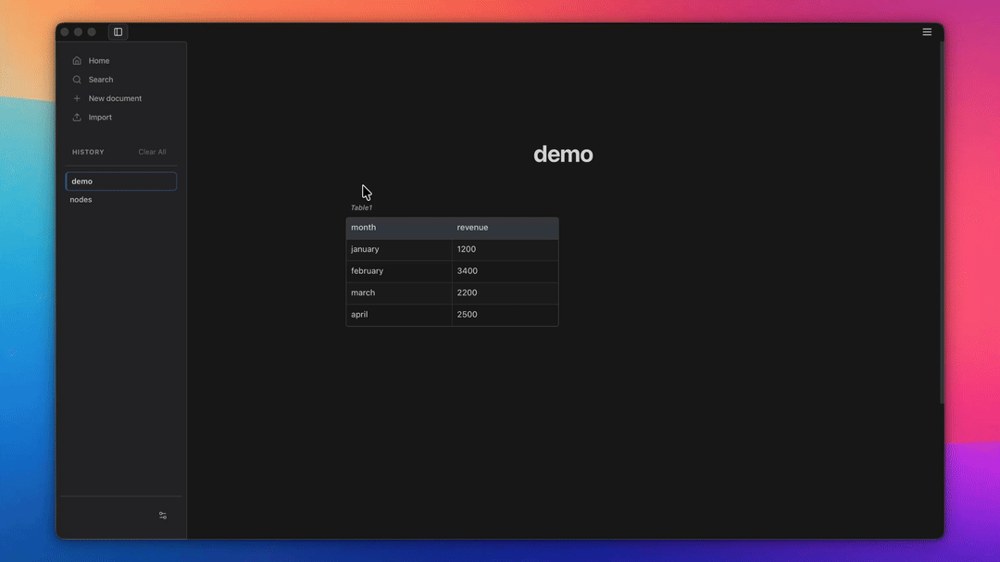

<p align="center">
  
</p>

<h1 align="center">ANQL</h1>

<p align="center">
  <strong>Write freely. Structure when needed.</strong>
</p>

<p align="center">
  
  
  
  
</p>

<p align="center">
  <a href="#about-anql">About ANQL</a> |
  <a href="#features">Features</a> |
  <a href="#getting-started">Getting Started</a> |
  <a href="#technical-details">Technical Details</a> |
  <a href="CONTRIBUTING.md">Contributing</a> |
  <a href="#community">Community</a>
</p>

<br />


---

## About ANQL

### Core Principles

The product is built around three principles:

- **Start simple:** writing should never require a database model or a setup step.
- **Add complexity only when needed:** tables, calculations, and charts appear when they help the thought in front of you.
- **Keep context together:** assumptions, decisions, data, results, and visualizations stay in the same document.

### Who Is ANQL For?

ANQL is for people who want to think clearly without being forced into a spreadsheet, a heavy database, or a coding environment.

- Students and researchers: Take lecture notes naturally, organize data in tables, calculate with Math blocks, and visualize results with charts in one document.
- Anyone working with data and calculations: merchants, freelancers, financial analysts, and more...

### Why ANQL?

- **Excel** is excellent for advanced analysis.
- **Notion** is excellent for collaboration and shared databases.
- **Jupyter Notebook** is excellent for code-driven computation.

ANQL is built for the space before, or between, those tools.
ANQL offers the freedom of simple notes, with more power available exactly when you need it.

---

## Features

- **Easy Writing**: Write, format with Markdown shortcuts, style by selecting text.
- **Smart Creation**: Type "table" or "h2" on a new line and press `TAB` to create it instantly.
- **Local SQLite Database**: Lightning-fast, reliable data persistence.
- **Full-text search**: Instantly find any thought across all your documents.
- **Offline-First**: Your data stays on your machine — always. No internet required.
- **Light & Dark mode**: Switch between themes to match your environment or preference.
- **Import & Export**: Open and save documents as Markdown, or as the native `.anql` format — a ZIP archive containing the document JSON and all embedded assets.
- **Tables, Math & Charts**: Combine structured data, calculations, and visualizations in one document.

<p align="center">
  
</p>

---

## Getting Started

### Download

ANQL is available for **macOS, Windows, and Linux**.

👉 [Download the latest release](https://github.com/anqlproject/anql/releases/latest)

### macOS Security Warning

Because ANQL is not currently signed and notarized with an Apple Developer certificate, macOS may block the downloaded application. If you trust the download source:

1. Open the downloaded `.dmg` or application in Finder.
2. Right-click **ANQL** and select **Open**.
3. Confirm by clicking **Open** in the warning dialog.

If macOS still blocks the application, remove the quarantine attribute from the downloaded app in Terminal:

```bash
xattr -dr com.apple.quarantine "/Applications/ANQL.app"
```

Then open ANQL normally from **Applications**. Only run this command for an application obtained from a source you trust.

### Build from source

**Prerequisites**
- Node.js 18+ and npm
- Rust and Cargo (for Tauri)
- macOS 11+ (Big Sur), Windows 10+, or a recent Linux distribution

```bash
# Clone the repository
git clone https://github.com/anqlproject/anql.git
cd anql

# Install dependencies
npm install

# Run in development mode
npm run tauri dev

# Build for production
npm run tauri build
```

---

## Troubleshooting

**Common Issues**

- **Build fails**: Ensure Node.js 18+ and Rust are installed
- **Tauri dev crashes**: Try clearing the cache: `rm -rf src-tauri/target`

For more help, check our [GitHub Issues](https://github.com/anqlproject/anql/issues) or join our [Discord](https://discord.gg/z5Jgg9m83).

---

## Technical Details

### Tech Stack

| Layer | Technology |
|---|---|
| Desktop framework | [Tauri](https://tauri.app/) |
| UI | [React](https://react.dev/) |
| Editor engine | [Lexical](https://lexical.dev/) |
| Math engine | [mathjs](https://mathjs.org/) |

### Platform Support

| Platform | Status |
|---|---|
| macOS | ✅ Supported |
| Windows | ✅ Supported |
| Linux | ✅ Supported |

### Roadmap

We're actively building. Here's what's on the roadmap:

- 🔗 **More export formats**
- 📊 **Advanced visualizations**

---

## Contributing

We welcome contributions! Whether it's reporting a bug, proposing a new feature, or submitting a pull request, your help is appreciated. 

Please see our [Contributing Guidelines](CONTRIBUTING.md) to learn how you can help build ANQL.

---

## Community

Got feedback? Found a bug? Have an idea?

💬 [Join our Discord server](https://discord.gg/z5Jgg9m83) — we'd love to hear from you.

🐛 [Report a bug or request a feature](https://github.com/anqlproject/anql/issues)

Follow us on [X / Twitter](https://x.com/anqlproject) for updates.

---

## License

This project is licensed under the MIT License - see the [LICENSE](LICENSE) file for details.
