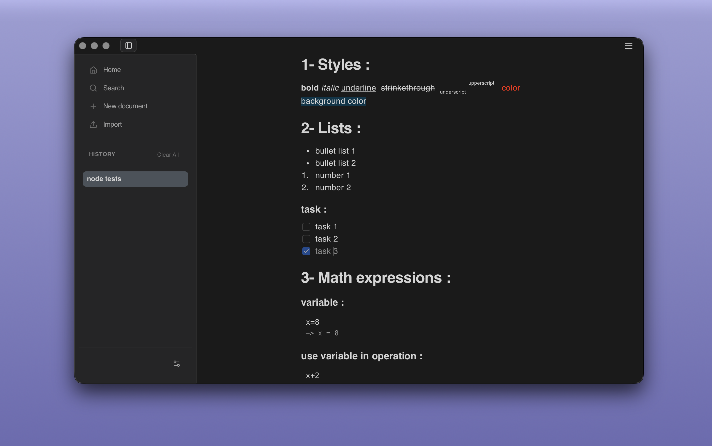

  

  
  

  <a href="#overview">Overview</a> | <a href="#features">Features</a> | <a href="#development">Development</a> | <a href="#platform-support">Platform Support</a> | <a href="#community">Community</a>

 

## Overview

ANQL is a visual workspace designed for productive work. Ideal for professionals, and anyone who needs to organize and work efficiently, it enables calculations, writing, and data management.

### Gallery

  
  

  

## Features

- **Rich text editing** - Create and format text with intuitive controls, perfect for note-taking.
- **Data management** - Structure and organize data through tables, mathematical operations, smart links between documents, local database storage, and organizations
- **Offline first** - Work without internet connectivity.
- **Dynamic calculations** - Perform mathematical operations and conversions perfect for engineering work and scientific calculations.
- **Unit conversion** - Convert between different units seamlessly.
- **Light & Dark mode** - Switch between light and dark themes for comfortable viewing in any environment.

### Node Types

ANQL supports multiple node types for different content needs, with the flexibility to transform between them:

- **Code** - Insert code blocks with syntax highlighting
- **Line** - Add horizontal separators
- **Image** - Insert images from URLs or files
- **Table** - Create structured tables
- **Heading 1/2/3** - Main section, subsection, and minor headings
- **Number List** - Ordered numbered lists
- **Bullet List** - Unordered bullet lists
- **Check List** - Todo/task lists with checkboxes
- **Quote** - Block quotes for citations
- **Math** - Mathematical operations and conversions
- **Date/Time** - Insert dates and timestamps
- **Equation** - Mathematical equations with LaTeX rendering
- **Link** - Smart links to external URLs, documents, or specific nodes
- **PDF** - Embed PDF documents directly in your content

**Smart Transformations**: Seamlessly convert any node type to another - turn text into headings, lists into checklists, or paragraphs into quotes. Adapt your content structure instantly without losing your work.

## Development

ANQL is currently in active development and may be unstable at times. New features and improvements are being added regularly. Feel free to reach out for feedback, bug reports, or feature suggestions.

**Upcoming Focus**: We are placing special emphasis on enhancing the Math node to support advanced calculations, statistical analysis, plotting, and graph generation - all while maintaining the seamless note-taking experience that makes ANQL a productive workspace.

### Tech Stack

- **Tauri** - Cross-platform desktop application framework
- **SQLite** - Local database storage
- **Lexical** - Rich text editing engine
- **React** - UI framework

## Platform Support

Currently, ANQL is tested and optimized for macOS only. Windows and Linux support will be available soon.

Download the macOS binary: [GitHub releases](https://github.com/anqlproject/anql/releases/tag/0.1.0)

## Community

Join our [Discord server](https://discord.gg/z5Jgg9m83) for discussions, report issues, or request new features.
